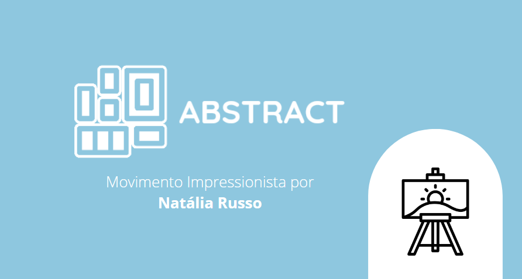

# Abstract - Impressionismo

O projeto tem como objetivo desenvolver de um website pelo qual o tema impressionismo seja exposto de forma clara. Por meio dele o usuário poderá preencher o questionário no qual será indicado, com base em suas respostas, com qual pintura ele tem maior relação. A mesma plataforma será utilizada para posterior consulta dos gráficos referentes as respostas dos usuários.

Projeto desenvolvido individualmente por <b>Natália Campioli Russo.</b>

Plataformas utilizadas:

 

Linguagens utilizadas:

